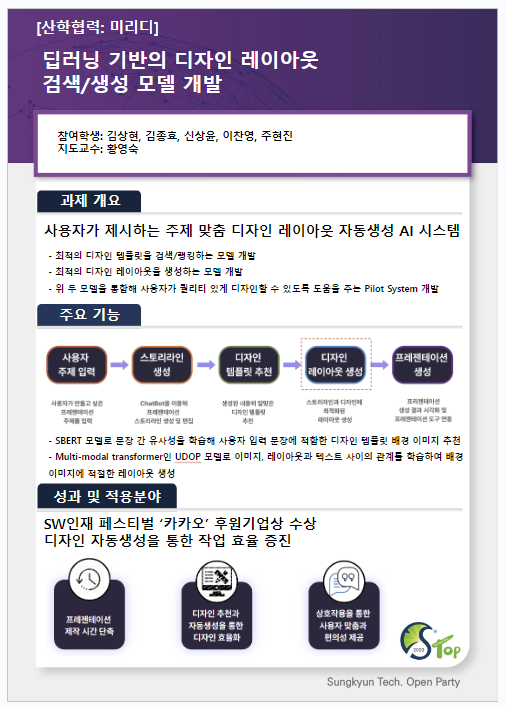

# Design-Assistant-AI

# How to use (in local host)
## 1. run api
```bash
python models/SBERT/api.py #run SBERT api
python models/UDOP_en/udop.py #run UDOP api
```
## 2. run local host
```bash
npm install
npm run dev
```

